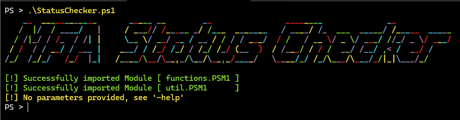
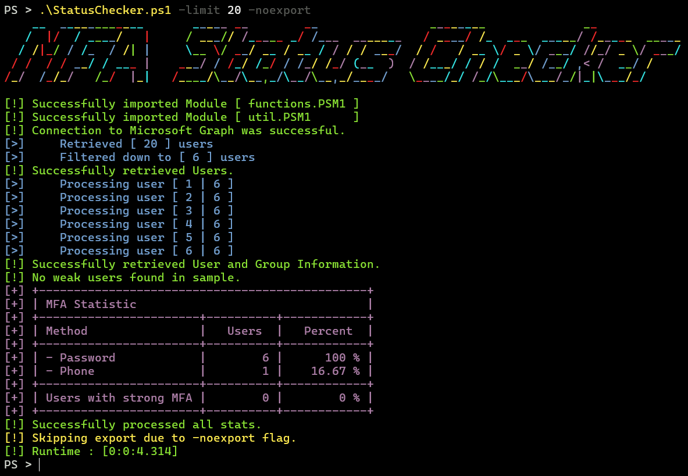
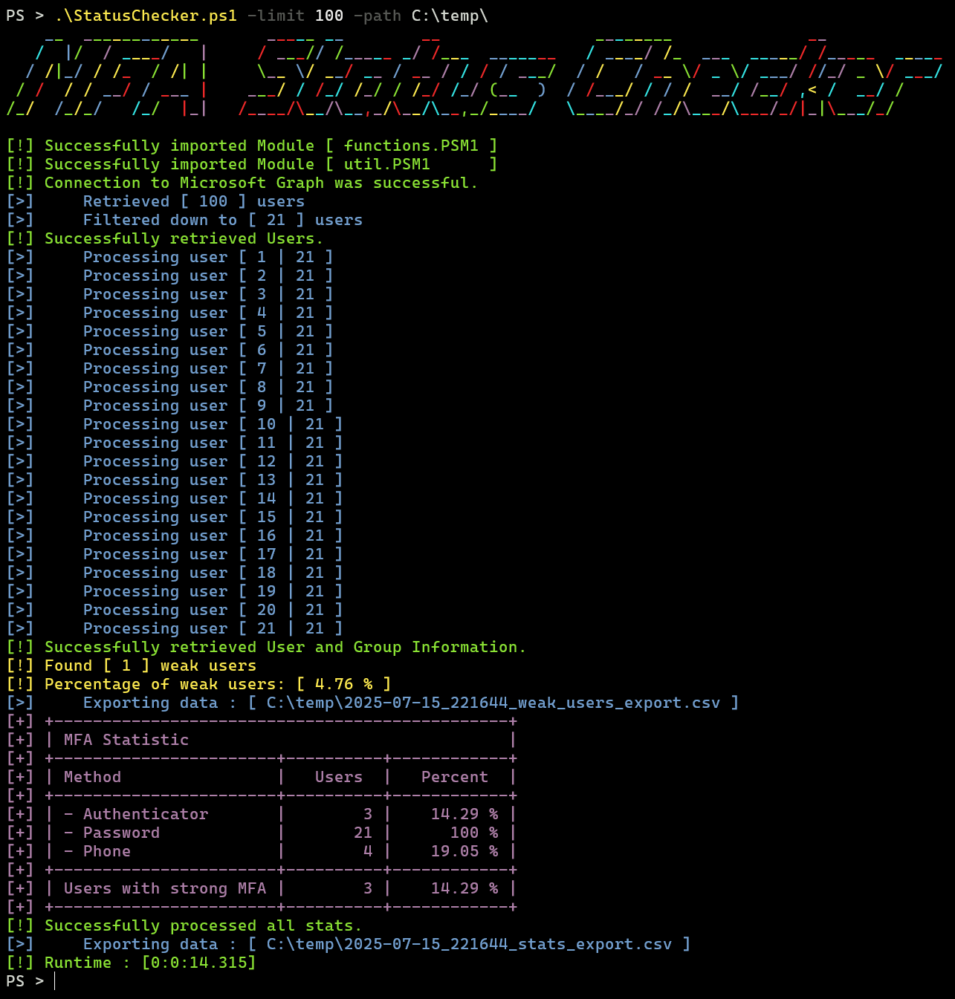
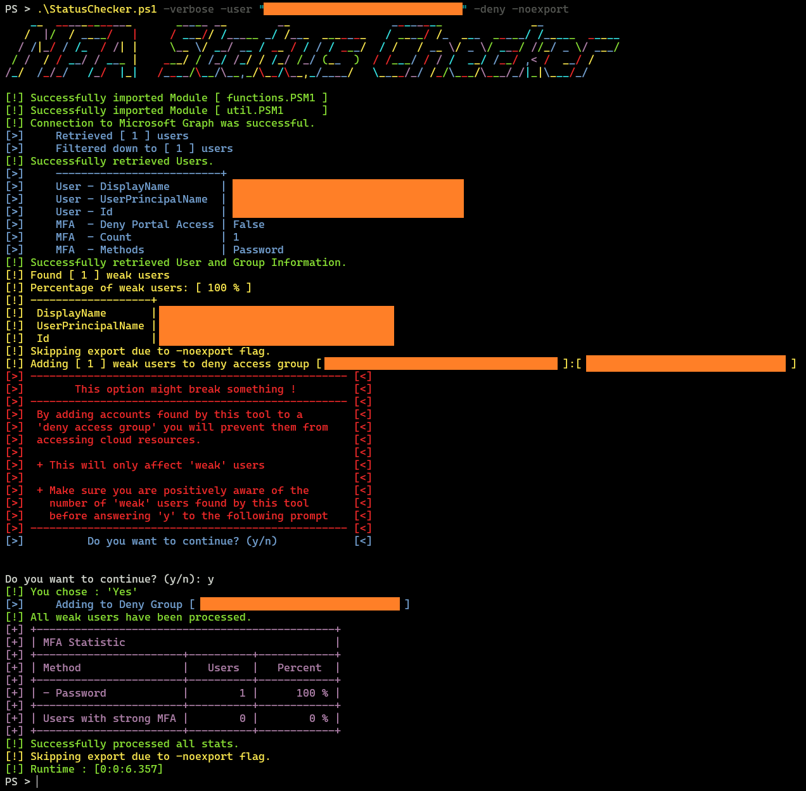

# MFA Status Checker



## Requirements

In short

- `Powershell`
- `User.Read.All`
- `Directory.Read.All`
- `UserAuthenticationMethod.Read.All` 
- `Connect-MgGraph`
- `Get-MgUser`
- `Get-MgUserMemberOf`
- `Get-MgUserAuthenticationMethod`
- `Get-ADUser`
- `Add-ADGroupMember`

## Usage

```text
+-------------------------------------------------------------------------------------------------------+
| Usage: .\StatusChecker.ps1 -option <argument>                                                         |
+-----------------------+-------------------------------------------------------------------------------+
| -path <path>          | override the default filepath (which is the current working directory)        |
| -verbose              | print all details                                                             |
| -quiet                | print no output to console                                                    |
| -limit <int>          | specify how many users to get, range from [1-999], default 10, accepts 'all'  |   
| -user <username>      | specify a user to check                                                       |
| -noexport             | only display results to terminal, does not dump CSV data                      | 
| -help                 | show this helptext and exit                                                   |
| -deny                 | add the weak users to the deny access group                                   |
----------------------+---------------------------------------------------------------------------------+
|                                                                                                       |
| - Examples                                                                                            |
|                                                                                                       |
| .\StatusChecker.ps1 -user 'firstname.lastname@example.com' -verbose                                   |
| .\StatusChecker.ps1 -limit 25 -verbose -deny                                                          |
| .\StatusChecker.ps1 -quiet -limit all -path 'C:\Users\user\dump'                                      |
| .\StatusChecker.ps1 -limit 100 -noexport                                                              |
|                                                                                                       |
+-------------------------------------------------------------------------------------------------------+
```

## Notes

- The Script relies on hardcoded values in `StatusChecker.ps1` that you need to customzie

  ```
  $global:company_name           = ""
  $global:deny_access_group_name = ""
  $global:deny_access_group_id   = ""
  $global:stats_csv_name         = "$(get-date -f yyyy-MM-dd_HHmmss)_stats_export.csv"
  $global:weak_csv_name          = "$(get-date -f yyyy-MM-dd_HHmmss)_weak_users_export.csv"
  ```

- The `company_name` is needed to further filter the API call as only to apply to 
  'real' members of a home tenant and ignore externally invited users.

- The Deny Group should be configured in your Conditional Access Policy to block user logins. 

* The script in general only queries user accounts with the following properties:
  - Account Enabled
  - Account Type 'Member'
  - Company Name matches
  - On-Prem / EntraID Sync Enabled
  
* A 'weak' user is a user account with all the properties above plus the following:
  - Not in Deny Access Group
  - Only has password configured

* A User with 'strong' MFA methods has atleast one of the following Methods set
  - Authenticator 
  - Fido2 Key
  - OAuth
  - Temporary Access Pass
  - Windows Hello for Business

* Password is the default Authentication Method set, so it is not considered at all for the stats.
  Likewise, the Phone Authentication Method is not considered strong due to Attacks like SIM-Swapping.

## Screenshots

- we start with a small sample



- we expand the scope and we find a vulnerable user



- we can deny them entry to the Tenant

